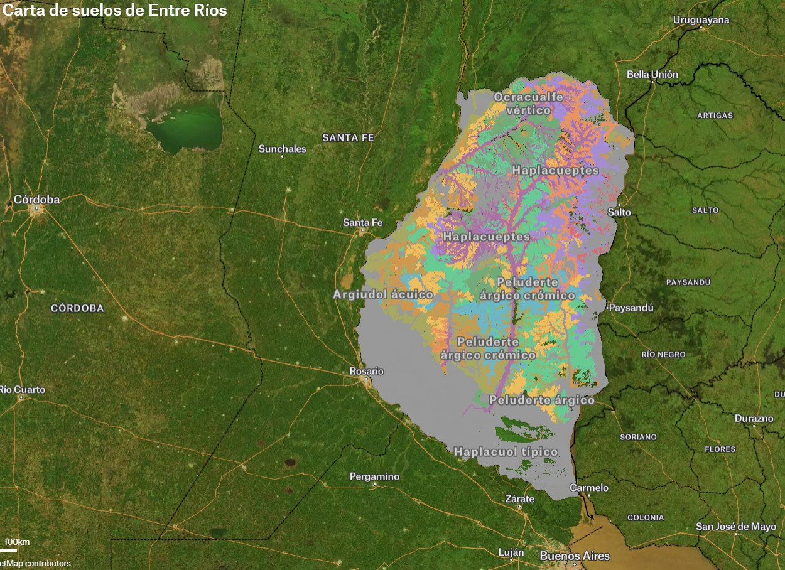

# Carta de Suelos de Entre Ríos

[Accede para navegar en el mapa 🌎](https://felt.com/map/Carta-de-suelos-de-Entre-Rios-5whiguPwSsSzPVr58t9AG6C?lat=-32.119386&lon=-59.288105&zoom=7.39)

<iframe src="https://ceregeo.github.io/Suelos_ER/" height="600" width="800" name="iframe_a" title="Carta de Suelos"></iframe>

<a href="https://ide-suelo.s3.amazonaws.com/suelos_ER.zip" target="iframe_a">Descarga</a>

<!--  

 <button>
                <a download="" href="https://ide-suelo.s3.amazonaws.com/suelos_ER.zip" target="_blank"
                    id="descarga">Descargar
                    capa</a>
            </button>

-->
